# Cloudiverse: Technical Architecture & System Design Report

**Author**: AWS Solutions Architect  
**Project**: Cloudiverse Decision Studio  
**Date**: June 2026 

---

## 1. Executive Summary

**Cloudiverse** is a full-stack, AI-powered cloud architecture decision studio designed to bridge the gap between natural language business requirements and production-ready Infrastructure-as-Code (IaC) blueprints. 

Built on a modern, decoupled three-tier architecture, the platform enables developers to describe their application needs in plain English, project cost profiles, auto-generate Terraform templates, and manage secure deployments. 


Originally launched on prototype-friendly developer platforms (**Vercel** and **Neon serverless Postgres**), Cloudiverse has been fully migrated to an enterprise-grade, highly available, and secure native **AWS topology** using **Amazon S3, Amazon CloudFront CDN, Application Load Balancers (ALB), Amazon ECS Fargate, and Amazon RDS PostgreSQL**. This report details the migration strategy, technical architecture, and system alignment with the AWS Certified Solutions Architect - Associate (SAA-C03) domains.

---

## 2. Business Problem & Solution

### 2.1 The Problem
Designing and deploying modern cloud infrastructure is slow, complex, and prone to error:
* **The Skills Gap**: Writing secure, multi-AZ, compliant Terraform templates requires deep infrastructure expertise.
* **Lack of Cost Visibility**: Developers often design and deploy resources without knowing the monthly cost implications until the bill arrives.
* **Multi-Cloud Friction**: Comparing identical architectures across AWS, GCP, and Azure requires manually translating service mappings and calculating different billing catalogs.

### 2.2 The Cloudiverse Solution
Cloudiverse addresses these issues through a visual, AI-assisted canvas that:
1. **Translates Natural Language**: Converts English requirements (e.g., *"I need a resilient API backend with a Postgres DB and global caching"*) into service specifications.
2. **Estimates Costs in Real-Time**: Queries localized service catalogs to project low, mid, and high cost thresholds.
3. **Generates Modular IaC**: Auto-generates fully parameterizable Terraform blueprints matching AWS best practices.

---

## 3. Systems Architecture & Network Topology

The architecture leverages a secure, isolated **AWS Virtual Private Cloud (VPC)** spanning multiple Availability Zones (AZs) to ensure high availability, automatic scaling, and zero public exposure for the database and runtime containers.

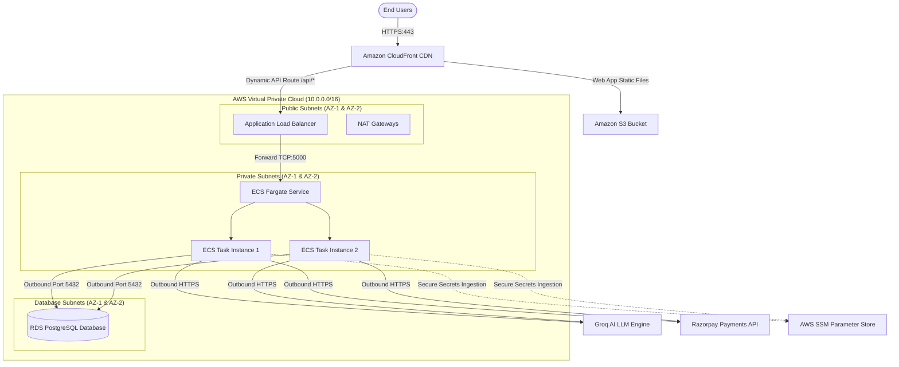

### 3.1 Network Isolation (Public vs. Private Subnets)
To guarantee security, the infrastructure is segmented into three distinct subnet tiers:
* **Public Subnets**: Contain the active-passive **Application Load Balancer (ALB)** and **NAT Gateways**. Only these resources are assigned public IPs.
* **Private Subnets**: Contain the **ECS Fargate Tasks** (running our Dockerized Express backend). They have no public IP addresses and communicate with the outside world via the NAT Gateways.
* **Database Subnets**: Contain the **Amazon RDS PostgreSQL** instance in a Multi-AZ cluster. These subnets are fully isolated and allow no direct outbound routing.

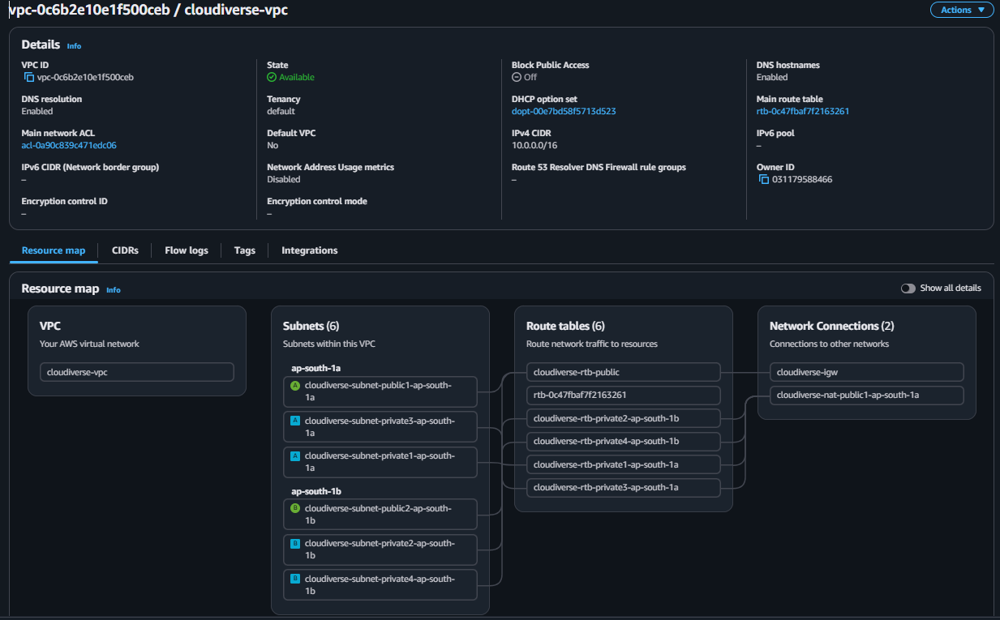

### 3.2 Ingress Controls & Load Balancing
* **ALB Security Group (`sg-alb`)**: Allows inbound TCP traffic on port `443` (HTTPS) from the internet.
* **ECS Security Group (`sg-ecs`)**: Restricts inbound traffic on port `5000` to packets originating **only** from the ALB security group (`sg-alb`).
* **RDS Security Group (`sg-rds`)**: Restricts inbound traffic on port `5432` to requests originating **only** from the ECS security group (`sg-ecs`).

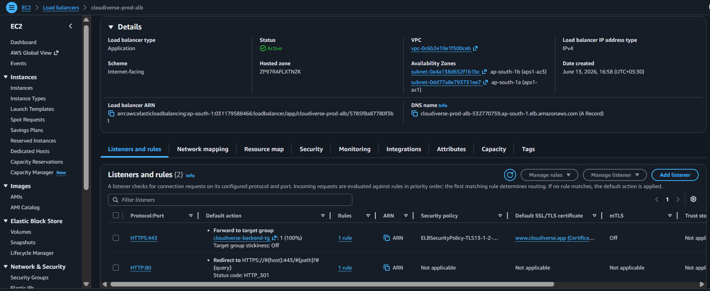
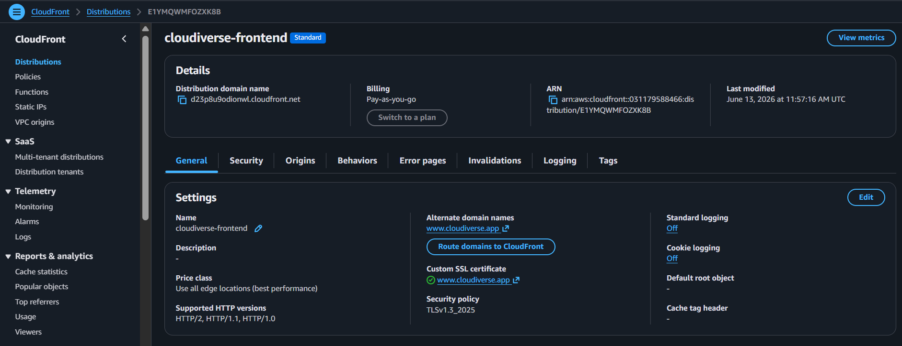

---

## 4. Vercel & Neon to AWS Migration Strategy

To move from a prototype stack to an enterprise AWS infrastructure, the hosting and database layers were migrated in two tracks:

### 4.1 Frontend Migration: Vercel to S3 + CloudFront
Vercel is an excellent host for static SPA (Single Page Application) bundles, but it operates outside our secure AWS perimeter. 
* **S3 Static Hosting**: We configured an Amazon S3 bucket to store the React client bundle. Crucially, the bucket has public access disabled. We established a **CloudFront Origin Access Control (OAC)** policy to permit read traffic only from our CloudFront distribution.
* **CloudFront SPA Routing Fallback**: Unlike traditional web servers, Single Page Applications rely on client-side routing. If a user refreshes `/workspaces`, the backend returns a `404` or `403` because the file `/workspaces/index.html` does not exist in S3. We added custom CloudFront error responses that catch `404` and `403` errors, rewrite the path to `/index.html`, and return a `200 OK` status, passing the routing duties to the React router.
* **Unified Domain Strategy**: To eliminate CORS issues and cookie domain complexities, CloudFront serves both static files (`/*`) and API calls (`/api/*`) on a single domain using routing behaviors:
  - Default Behavior (`/*`): Directs to S3.
  - API Behavior (`/api/*`): Directs to the Application Load Balancer (ALB).

### 4.2 Database Migration: Neon (Serverless) to Amazon RDS PostgreSQL
Neon is a serverless Postgres database that autoscales to zero. For production workloads, we migrated to AWS RDS PostgreSQL.
* **Networking Placement**: Placed RDS in a dedicated Subnet Group across private DB subnets in two AZs to enforce strict boundary controls.
* **Connection Capacity Planning**: Neon scales connections transparently. RDS Postgres, running on fixed-compute instances, has hard limits on maximum concurrent client sockets. To manage this safely under scale-out conditions, the Node.js Express backend uses a custom-configured `pg-pool` client with a pool size limit of `20` concurrent connections per task, preventing DB socket exhaustion during auto-scaling spikes.

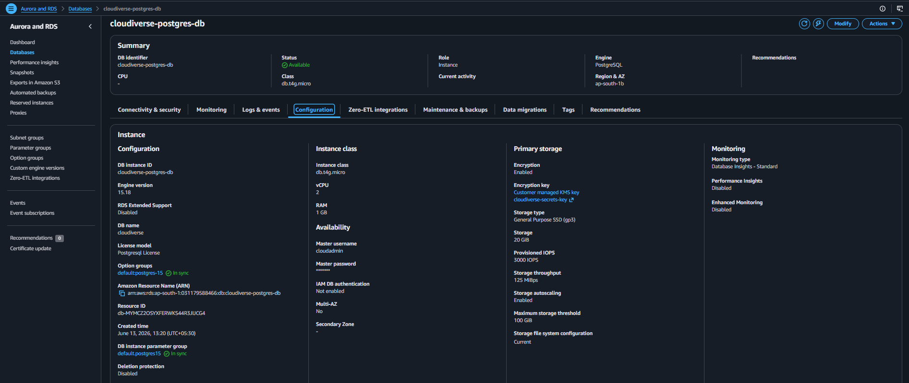

* **Data Migration Execution (Zero Data Loss)**:
  1. **Schema & Data Export**: Extracted database tables and schemas from the Neon cluster using pg_dump:
     ```bash
     pg_dump -h db.neon.tech -U username -d cloudiverse --clean --no-owner -f db_dump.sql
     ```
  2. **VPC Tunneling**: Because the target RDS instance is in a private subnet, it cannot be reached from the internet. We launched a temporary micro-instance **EC2 Bastion Host** in a public subnet, configured to allow SSH access only from the developer's IP.
  3. **Data Restoration**: Restored the DB schema and entries by piping the dump through an SSH tunnel to the private RDS endpoint:
     ```bash
     psql -h rds-prod.ap-south-1.rds.amazonaws.com -U rds_user -d cloudiverse -f db_dump.sql
     ```

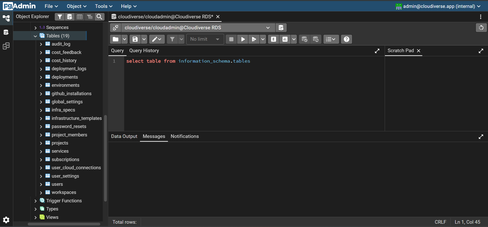

---

## 5. SAA-C03 Core Domains Mapping

To validate this design under the standard AWS Solutions Architect rubric, we map the infrastructure decisions to the four primary domains:

### 5.1 Domain 1: Design Secure Architectures
* **Network Isolation**: The application backend and database are isolated inside private/database subnets with zero direct internet access.
* **Secure Secret Ingestion**: System configurations and credentials (database strings, Groq API keys, payment certificates) are stored in **AWS SSM Parameter Store** as encrypted `SecureString` values using AWS KMS-managed keys. They are injected as environment variables in-memory during container boot, meaning no `.env` files are stored in Docker registries (ECR) or source code.

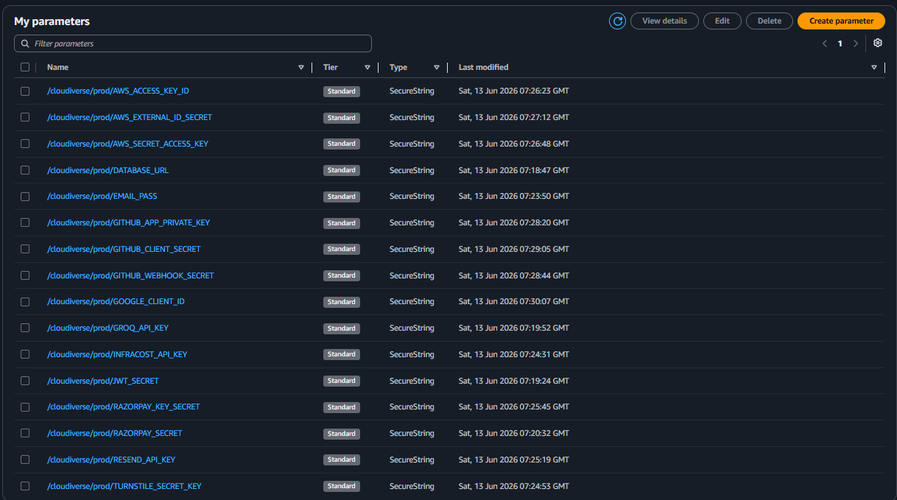

* **IAM Least Privilege Roles**: The ECS container agent is granted permissions to read only the specific SSM parameter path `/cloudiverse/prod/*`.

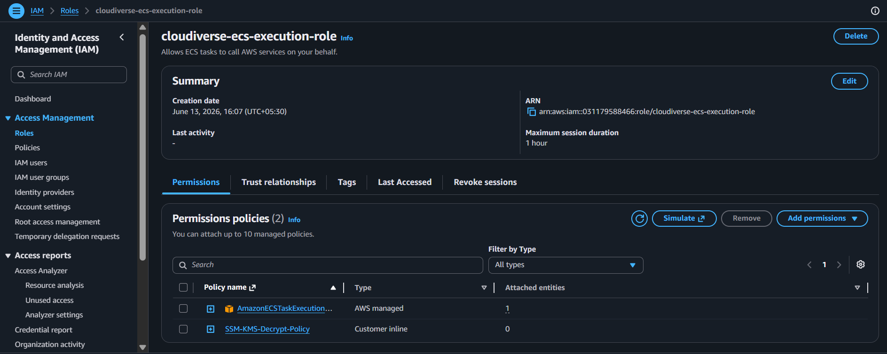

* **Application Protection**: We integrated **Helmet.js** to secure Express HTTP headers, AWS WAF rules, and **Cloudflare Turnstile** for silent CAPTCHA protection, preventing bot abuse on auth endpoints.

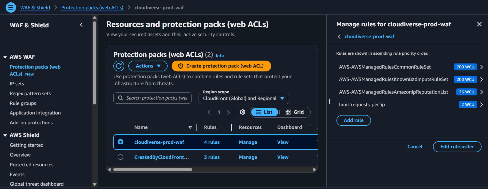

### 5.2 Domain 2: Design Resilient Architectures
* **Multi-AZ Availability**: The ALB, ECS, and RDS instances are distributed across multiple Availability Zones. If an entire AZ suffers an outage, AWS automatically routes traffic to the remaining healthy zone.
* **ECS Self-Healing Tasks**: If an Express server container crashes or fails the HTTP `/health` check, the ECS Agent terminates the unhealthy container and spawns a new task in a healthy AZ.
* **RDS Multi-AZ Failover**: AWS RDS keeps a synchronous standby replica in a secondary AZ. In the event of a primary database failure, AWS automatically promotes the standby to primary and updates DNS mappings, reducing downtime to less than 60 seconds.

### 5.3 Domain 3: Design High-Performing Architectures
* **Static Content Acceleration**: Amazon S3 coupled with CloudFront CDN caches the React static bundle close to users at edge locations, offloading traffic from the API nodes.
* **Stateless API Tier**: The Dockerized Express backend uses stateless JWT authentication. Because there is no local session state, containers can process incoming requests interchangeably, making the backend horizontally scalable.

### 5.4 Domain 4: Design Cost-Optimized Architectures
* **Serverless Compute Pricing**: Using Fargate compute eliminates the cost of idling EC2 instances. You pay per-second only for the active CPU and Memory allocated to the tasks.
* **S3 Static Website Hosting**: Storing frontend files in S3 is highly cost-effective ($0.023/GB) compared to running an EC2 server to serve static assets.

---

## 6. End-to-End Request Lifecycle & Connection Flow

The lifecycle of an API request on Cloudiverse follows a structured security path:

```
[ User Browser ]
       │  1. HTTPS GET /api/workspaces (Port 443)
       ▼
[ CloudFront Edge ] ──(Matches /api/*, forwards request)──> [ ALB (Public Subnet) ]
                                                                   │
                                                                   │ 2. Routes to Target Group
                                                                   ▼
[ RDS PostgreSQL ] <──(3. Port 5432 query)── [ ECS Fargate Task (Private Subnet: 5000) ]
                                                                   │
                                                                   │ 4. Outbound API Call
                                                                   ▼
                                                             [ NAT Gateway ]
                                                                   │
                                                                   ▼
                                                            [ Groq LLM API ]
```

1. **Edge Ingress**: The client initiates an HTTPS request to `https://cloudiverse.app/api/workspaces`. CloudFront terminates the SSL handshake at the nearest edge location.
2. **Behavior Routing**: CloudFront checks matching path behaviors. Since it matches `/api/*`, the request bypasses S3 and is routed directly to the public **Application Load Balancer (ALB)**.
3. **Load Balancing**: The ALB decrypts and inspects the request. It distributes the traffic across the active **ECS Fargate Tasks** in the private subnets.
4. **Application Logic**: The ECS Fargate container running Express parses the JWT from the authorization header, verifies it, and makes a database query to **RDS PostgreSQL** inside the Database subnet over port `5432`.
5. **Egress Gateway Routing**: If the workspace requires AI generation, the Fargate task makes an HTTPS call to the **Groq API** (`https://api.groq.com`). The route table directs this outbound packet to the **NAT Gateway** in the public subnet, which performs Network Address Translation (NAT) and sends it out to the public internet.

---

## 7. Technology Stack & Rationale

| Tier | Tech | Rationale |
| :--- | :--- | :--- |
| **Frontend** | React 18, Vite | High performance component-based design, sub-second HMR, and optimized tree-shaked production builds. |
| **Backend** | Node.js, Express.js | Dynamic, non-blocking asynchronous event loop optimized for managing large payloads and generating Terraform archives. |
| **Database** | PostgreSQL (RDS) | ACID transactions, relational schema integrity, and native JSONB columns for storing arbitrary workspace canvas coordinates. |
| **Secret Storage**| AWS SSM | Secure storage and versioning of credentials with automatic KMS decryption, keeping secrets out of Git repositories. |

---

## 8. CI/CD & Deployment Pipeline

The application features a fully automated Git-triggered deployment workflow configured in GitHub Actions:

### 8.1 Backend Docker Deployment
1. **Push Event**: A code commit is pushed to the `main` branch of the private codebase.
2. **Docker Build**: The runner builds the Docker image:
   - Uses `node:20-alpine` to keep the image size below 200MB.
   - Installs dependencies using `npm ci --omit=dev` for clean, consistent builds.
3. **Registry Upload**: Authenticates to **Amazon ECR** and pushes the new image tagged with the Git Commit SHA and `latest`.

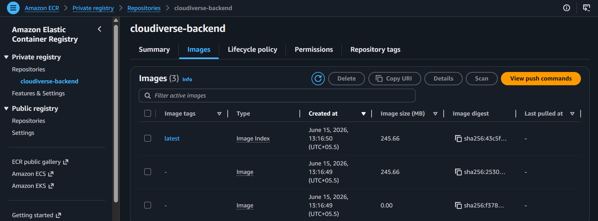

4. **ECS Force Deployment**: Triggers a Fargate service update:
   - Starts a rolling update (`aws ecs update-service --force-new-deployment`).
   - ECS provisions new tasks running the new image.
   - New tasks execute `/health` checks. Once healthy, the ALB target group redirects routing traffic.
   - The old tasks are terminated with zero system downtime.

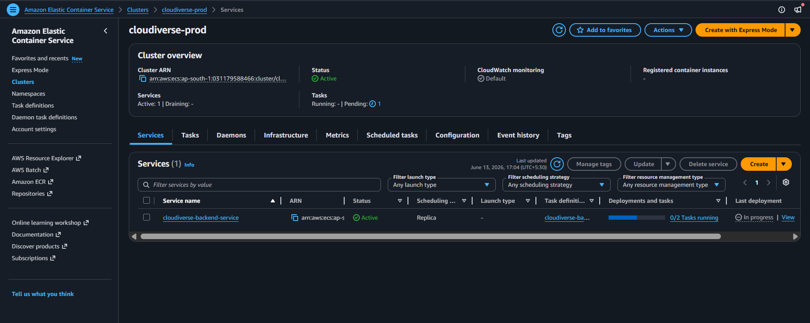


### 8.2 Frontend Deployment
1. **React Compile**: The runner runs `npm install` and compiles assets with `npm run build` using Vite.
2. **S3 Synchronization**: Syncs the build output (`dist/`) directly to the S3 bucket:
   ```bash
   aws s3 sync dist/ s3://cloudiverse-frontend --delete
   ```
3. **CDN Invalidation**: Forces a CloudFront edge cache invalidation (`/*`) so that users immediately download the newly compiled bundle rather than reading cached assets.
