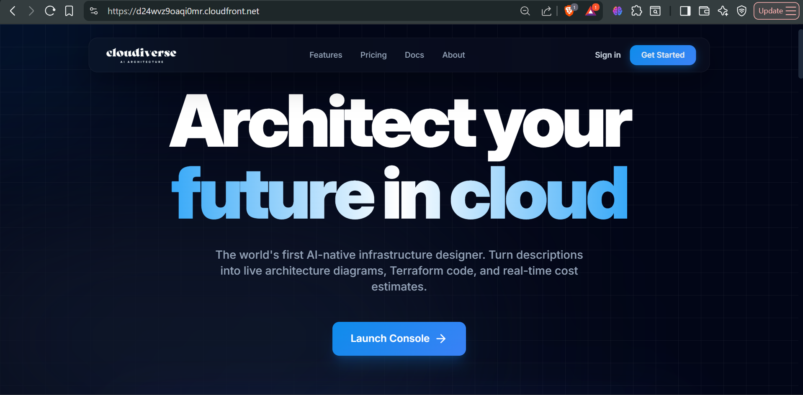
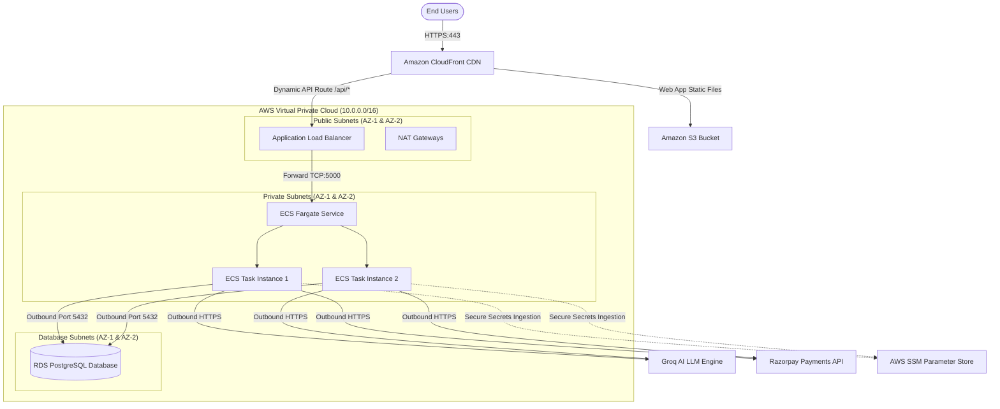
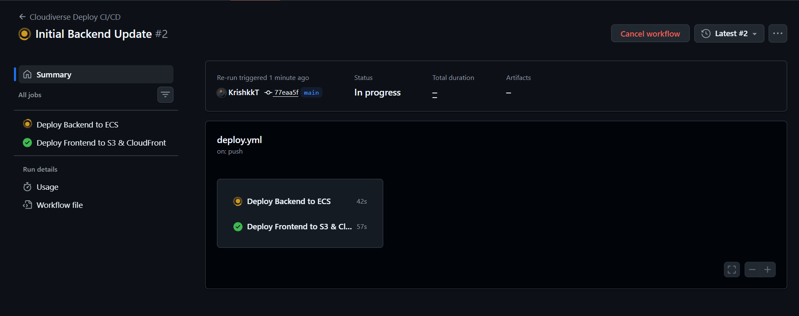

# Cloudiverse: AI-Powered Cloud Architecture Decision Studio

> **Translate natural language requirements into cost-optimized, production-ready multi-cloud Terraform blueprints with real-time AI validation and enterprise-grade AWS infrastructure.**

---

## 🚀 Project Overview

**Cloudiverse** is a full-stack, AI-powered cloud architecture decision studio designed to bridge the gap between high-level business requirements and production-ready Infrastructure-as-Code (IaC) blueprints.

Built on a decoupled full-stack architecture (**React, Node.js/Express, and PostgreSQL**) and deployed inside a highly available, secure, and isolated **AWS VPC** (using **Amazon S3, CloudFront CDN, Application Load Balancers, ECS Fargate, and RDS PostgreSQL**), the platform enables developers to describe their application needs in plain English, dynamically project cost-estimates, auto-generate Terraform templates, and manage secure deployments.

This repository serves as the public showcase configuration, detailing the system architecture, migration paths, and deployment pipelines.

## 🎨 System Architecture & Infrastructure

Cloudiverse is deployed inside a multi-AZ VPC, ensuring high availability and isolating the application and database tiers from the public internet.

### 🔒 Enterprise-Grade Security Architecture

- **Network Isolation**: The ECS tasks and database live inside isolated private subnets with no public IPs. Ingress is allowed _only_ from the ALB, and egress is restricted via NAT Gateways.
- **Database Access Restriction**: The RDS PostgreSQL database is placed in the database subnet and accepts traffic _exclusively_ from Fargate containers on port `5432`.
- **KMS-SSM Secret Ingestion**: No `.env` files are stored in ECR/ECS. All passwords and keys are fetched from **AWS Systems Manager (SSM) Parameter Store** and decrypted in memory on container startup.
- **Security Headers & BOT Protection**: Express is secured with **Helmet.js** to enforce strict CSP, and authentication forms are protected by silent **Cloudflare Turnstile** challenges.

---

## 🔄 Vercel & Neon to AWS Migration Overview

Originally hosted on prototype developer platforms, Cloudiverse was migrated to native AWS services to achieve strict network boundaries and professional architecture standards:

1. **Frontend (Vercel ➔ S3 + CloudFront)**:
- React assets were moved to a private **Amazon S3** bucket.
- **Amazon CloudFront** was placed in front, using **Origin Access Control (OAC)** to block direct public access to S3.
- Configured custom CloudFront error page overrides to redirect `404/403` status codes to `/index.html` with a `200` status, resolving Single Page Application (SPA) client-side routing refreshes.
- Consolidated frontend routing and `/api/*` traffic onto a single domain to bypass CORS restrictions.
2. **Database (Neon ➔ Amazon RDS PostgreSQL)**:
- Configured an RDS PostgreSQL Multi-AZ DB Subnet Group across private subnets.
- Refactored backend client connectivity using `pg-pool` to handle RDS static connection limits under scale.
- Dumped the database using `pg_dump` and restored it securely over a temporary **EC2 Bastion SSH Tunnel** to the private RDS endpoint.

---

## 🏎️ Request Processing Flow

1. **Client Request**: Client queries `https://cloudiverse.app/api/workspaces`.
2. **Edge Processing**: CloudFront intercepts the connection, decrypts SSL, and forwards the `/api/*` path to the **ALB**.
3. **Internal Routing**: ALB forwards the traffic across healthy **ECS Fargate Tasks** in the private subnets.
4. **Data Sync**: The backend container queries **RDS PostgreSQL** inside the Database subnet over port `5432`.
5. **Egress calls**: External calls (like Groq LLM API or payments) exit the private subnet securely via the **NAT Gateways**.

---

## 🔄 Deployment Automation (CI/CD Flow)

When code is pushed to the private repository's `main` branch, a dual-track GitHub Actions pipeline runs:

```mermaid
sequenceDiagram
    actor Developer
    participant GitHub as GitHub Private Repo
    participant Actions as GitHub Actions Runner
    participant ECR as Amazon ECR
    participant ECS as Amazon ECS Fargate
    participant S3 as Amazon S3 Bucket
    participant CF as Amazon CloudFront

    Developer->>GitHub: git push origin main
    GitHub->>Actions: Trigger CI/CD Workflow
    
    rect rgb(20, 25, 40)
        Note over Actions, ECS: Backend Track (ECR + ECS)
        Actions->>ECR: Login & Push Docker Image (latest)
        Actions->>ECS: Register Task Revision & Force Rolling Update
    end

    rect rgb(30, 45, 60)
        Note over Actions, CF: Frontend Track (S3 + CDN)
        Actions->>Actions: npm run build (Compile React files)
        Actions->>S3: Sync build contents (Delete old files)
        Actions->>CF: Invalidate Edge Cache (/*)
    end
```

---

## 🛠️ Technology Stack

- **Frontend**: React 18, Vite, Tailwind CSS, React Router DOM, Recharts, Axios.
- **Backend**: Node.js, Express.js, pg-pool (PostgreSQL client).
- **Database**: PostgreSQL (AWS RDS).
- **DevOps**: Docker, AWS CLI, Terraform, GitHub Actions.
- **APIs & Integrations**: Groq LLM API, Razorpay Checkout SDK, Cloudflare Turnstile CAPTCHA.

---

## 📄 Complete Project Documentation

For a deep dive into the engineering choices, database schemas, security configurations, and performance optimization details, read the complete project architectural paper:

📖 **[Read the Full Project Architecture & Design Report](Project_Architecture_Report.md)**